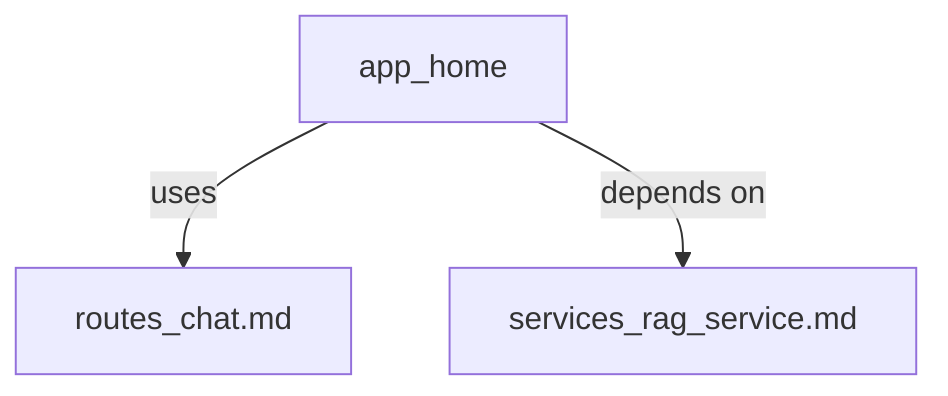

# App Home Module Documentation

## Overview
The `app_home` module serves as the entry point for user interactions with the application. It primarily handles routing and initializes necessary services required to interact with the RAG (Retrieval-Augmented Generation) system, allowing users to ask questions based on provided documents or data.

## Core Functionality
- **Flask Application Initialization:** Initializes a Flask web server instance that serves as the backend API for handling user requests. It includes setting up CORS policies and registering routes for question-answer interactions with chat_bp blueprint.
- **Entry Route:** Provides an entry route (`/`) which responds with a simple message indicating the system's readiness to handle requests, serving as a basic health check endpoint.

## Architecture Overview
Below is a high-level overview of how `app_home` integrates within the larger application architecture. Please refer to specific module documentation for detailed information on individual components:
- **Dependencies:** The app_home module depends on the routes.chat.ask blueprint for handling chat functionality and services.rag_service for RAG-based question answering.

## Component Relationships
The following diagram illustrates how the `app.home` component interacts with other modules within the system:

## Data Flow and Process Flows

## Data Flow and Process Flows
When a user sends an API request to the `/` endpoint, here's what happens:
1. The `home()` function is invoked from within the app_home module, responding with a health check message.
2. For chat functionality, requests are routed to routes.chat.ask based on registered blueprint in app_home.
When a user sends an API request to the `/` endpoint, here's what happens:
1. The `home()` function is invoked from within the app_home module, responding with a health check message.
2. For chat functionality, requests are routed to routes.chat.ask based on registered blueprint in app_home.

## References
- [routes_chat.md](./routes_chat.md)
- [services_rag_service.md](./services_rag_service.md)