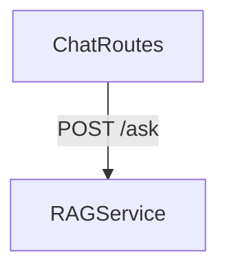
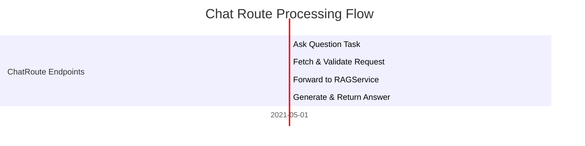

# Chat Routes Module Documentation

## Overview
The chat_routes module is a critical component of the system, responsible for handling user queries through an API endpoint. Specifically, it manages the `/ask` route which receives questions from users and returns answers generated by the RAG (Retrieval-Augmented Generation) service.

## Purpose
- The primary purpose of this module is to act as a bridge between the user interface and backend services, processing incoming requests and returning appropriate responses.
- It leverages the `ask_question` function from the RAG service to retrieve answers for user queries.

## Dependencies
Dependencies include:
- [rag_service.md](rag_service.md): Handles prompting templates, question answering, and document formatting among others.

## Architecture & Component Relationships
### Architecture Diagram


### Data Flow
The data flow within the `chat_routes` module is as follows:
1. **Incoming Request:** A POST request with a JSON payload containing a user's question arrives at the `/ask` endpoint.
2. **Parsing & Validation:** The request is parsed to extract the question, and validation checks are performed (e.g., ensuring that a valid non-empty question has been provided).
3. **Forwarding to RAG Service:** If no errors occur during parsing or validation, the extracted question is passed to the `ask_question` function in the RAG service.
4. **Answer Generation & Return:** The response from the RAG service (containing an answer) is returned back to the user via a JSON format as part of the HTTP 200 OK status.

### Process Flow Diagram


## Component Interaction Diagrams
### Chat Route Component Interaction with RAG Service
```mermaid
graph TD;
    subgraph UserInterface
        UserInterface -->|POST /ask| chat_routes
    end
    subgraph chat_routes
        chat_routes -->|question| rag_service
    end
    subgraph rag_service
        rag_service -->|answer| chat_routes
    end
```
