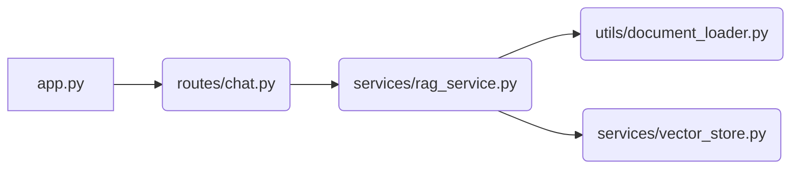

# Backend Module Documentation

## Introduction
The backend module is responsible for providing a robust and scalable framework to handle question answering tasks based on document retrieval. It integrates various services such as vector store management, chat routing, and RAG (Retrieval-Augmented Generation) service.

## Architecture Overview
The architecture of the backend module is composed of several sub-modules that interact with each other to provide a seamless experience for users. The following diagram provides an overview of the main components:

1. **app.py**: Entry point of the application that initializes and runs the Flask server.
2. **routes/chat.py**: Handles chat-related routes such as `/ask` which processes incoming questions and returns answers from the RAG service.
3. **services/rag_service.py**: Core logic for the retrieval-augmented generation (RAG) system, including question handling, document retrieval, and language model integration.
4. **utils/document_loader.py**: Provides utilities to load and split documents into chunks suitable for vector store indexing.
5. **services/vector_store.py**: Manages the creation, loading, and querying of a vector-based document store using LangChain Chroma backend.

## Sub-modules
Detailed documentation on individual sub-modules can be found below:
- [Vector Store](vector_store.md)
- [Chat Routes](chat_routes.md)
- [RAG Service](rag_service.md)
- [Document Loader Utilities](document_loader_utilities.md)