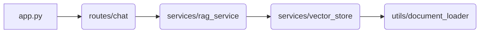

# Backend Documentation

## Introduction

The backend module is designed to provide a robust and scalable solution for Retrieval-Augmented Generation (RAG) using LangChain. This documentation will guide developers through understanding the architecture, core functionality, and integration of the components within the system.

## Architecture Overview

### Diagrams

The backend module consists of a series of interconnected components that work together to provide RAG functionality. Below is an overview of the architecture:

1. **app.py**: The entry point for the Flask application, initializing necessary configurations and registering blueprints.
2. **routes/chat.py**: Defines the endpoint for sending questions to the RAG service.
3. **services/rag_service.py**: Manages the interaction between LLMs (Language Model) and vector stores, providing a chain of operations to answer user queries based on context documents stored in the vector store.
4. **services/vector_store.py**: Handles the creation, loading, and retrieval from vector stores using Chroma as the database.
5. **utils/document_loader.py**: Provides utilities for loading and splitting document files into manageable chunks before storing them in the vector store.

Each component plays a critical role in ensuring that the RAG system operates efficiently and accurately.