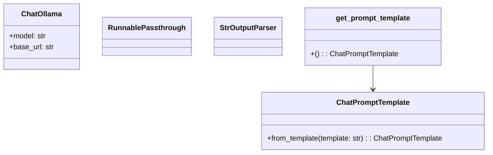
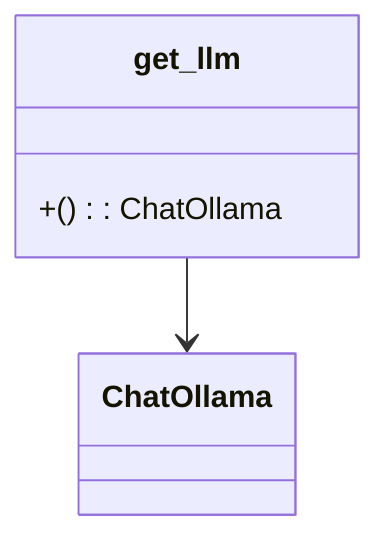
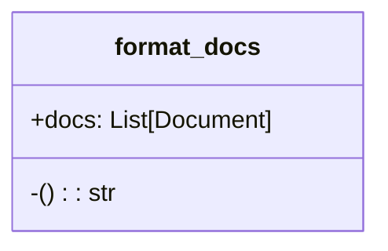

# rag_service Module Documentation

## Overview
The `rag_service` module is a key component of the system designed to implement Retrieval-Augmented Generation (RAG) capabilities. It primarily focuses on handling question-answering interactions by leveraging context from vector stores and language models.

This module works in conjunction with other core modules such as `vector_store`, `chat_routes`, and `document_loader_utilities` to provide a comprehensive RAG system that integrates document loading, retrieval, prompt templating, and language model interaction.

## Core Functionality
- **Prompt Template Management:** Defines and returns the chat prompt template used for generating responses based on provided context and questions.
- **Language Model Interaction:** Facilitates interactions with the Ollama language model to generate coherent and contextually relevant answers.
- **RAG Chain Creation:** Assembles the RAG chain, which includes retrieval from a vector store, formatting retrieved documents into text, prompting the language model, and parsing the output response.
- **Document Formatting:** Transforms lists of retrieved documents into a continuous textual format suitable for passing to the language model.

## Components Overview
### get_prompt_template
Returns a `ChatPromptTemplate` configured with specific instructions for generating contextually relevant responses based on provided question and document context.

### get_llm
Returns an instance of `ChatOllama` configured with the model and base URL specified in system configurations.

### format_docs
Transforms a list of retrieved documents into a continuous textual format suitable for passing to the language model.

### get_rag_chain
Assembles and returns the RAG chain which includes document retrieval, formatting of retrieved documents into text, prompting the language model with context and question, and parsing the output response.
```mermaid
classDiagram
    class get_retriever{
        +(): RetrievalHandler
    }
    class get_prompt_template{
        +(): ChatPromptTemplate
    }
    class format_docs{
        +docs: List[Document]
        -(): str
    }
    class get_llm{
        +(): ChatOllama
    }
    class StrOutputParser{}
    class RunnablePassthrough{}
    class get_rag_chain{
        +(): Runnable
    }
    get_retriever --> RetrievalHandler
    format_docs --> str
    get_prompt_template --> ChatPromptTemplate
    get_llm --> ChatOllama
    get_rag_chain --> Runnable
