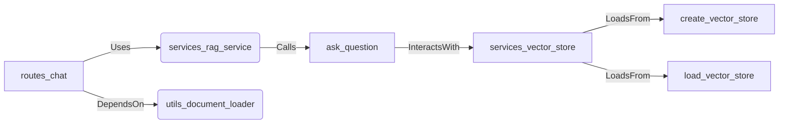

# routes_chat Module Documentation

## Overview
The `routes_chat` module is a Flask blueprint that handles the chat functionality, specifically the `/ask` endpoint which allows users to ask questions and receive answers generated by the RAG (Retrieval-Augmentation-Generation) service.

## Core Functionality
### Routes.chat.ask
This route accepts POST requests with a JSON payload containing the user's question. It leverages the `services.rag_service.ask_question` method to process the request, retrieve relevant information from vector stores and generate an answer for the given question.

#### Endpoint: `/ask`
- **Method**: POST
- **Description**: Accepts a question in JSON format and returns an answer generated by the RAG service.
- **Payload**:
  - `question`: The user's input question (required).
- **Response**:
  - Success: Returns a JSON object with the key 'answer' containing the generated response.
  - Error: If the request is malformed or an internal server error occurs, returns appropriate HTTP status codes and error messages.

## Architecture Overview
The `routes_chat` module forms part of the application's overall architecture by integrating with other modules such as `services_rag_service`, which provides the business logic for RAG, and interacts directly with vector stores via `services_vector_store`. It also depends on `utils_document_loader` for loading documents that feed into the retrieval process. The following diagram illustrates this relationship.



    D -->|LoadsFrom| E[create_vector_store];
    D -->|LoadsFrom| F[load_vector_store];
    A -->|DependsOn| G(utils_document_loader);
```