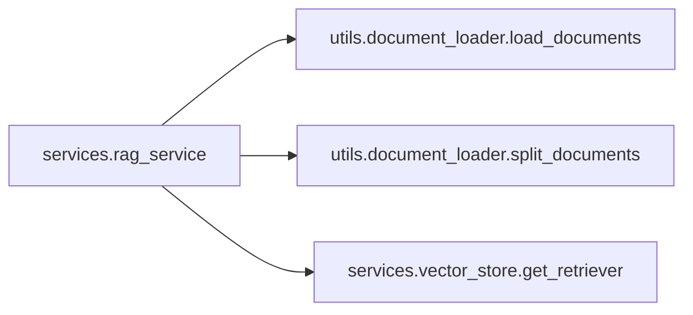

# services_rag_service Module Documentation

## Overview
The `services_rag_service` module provides the core functionality for Retrieval-Augmented Generation (RAG) using an LLM (Large Language Model). This service is responsible for processing questions with context retrieved from a vector store and generating appropriate responses based on the provided documents.

## Core Components
- **get_prompt_template**: Returns a predefined prompt template used to structure the input given to the LLM.
- **get_rag_chain**: Constructs a complete RAG chain that includes document retrieval, prompt creation, and response generation using an LLM.
- **get_llm**: Initializes and returns an instance of ChatOllama for interaction with the chosen model from OLLAMA_BASE_URL and OLLAMA_MODEL.
- **ask_question**: Accepts a user question, invokes the RAG chain, and returns a generated answer.
- **format_docs**: Transforms retrieved documents into text format suitable as context input to the LLM.

## Architecture Overview
The `services_rag_service` module is designed to work in tandem with other services such as `vector_store` for document retrieval. It leverages dependencies from these modules and integrates them within its RAG chain workflow, ensuring a seamless process from question intake to answer generation.

### Dependencies Diagram


## Data Flow and Interaction Diagrams


## Dependencies Documentation Links
- [utils.document_loader](./utils_document_loader.md)
- [services.vector_store](./services_vector_store.md)
```mermaid
sequenceDiagram;
participant User
participant services.rag_service as RAGS
participant utils.document_loader as UDL
participant services.vector_store as VST

User->>RAGS: ask_question(question)
RAGS->>VST: get_retriever()
VST-->>RAGS: retriever object
RAGS->>UDL: load_documents()
UDL-->>RAGS: document list
RAGS->>UDL: split_documents(document list)
UDL-->>RAGS: split documents
RAGS->>VST: retrieve docs using retriever
VST-->>RAGS: retrieved documents
RAGS->>RAGS: format_docs(retrieved docs)
RAGS-->>User: response```