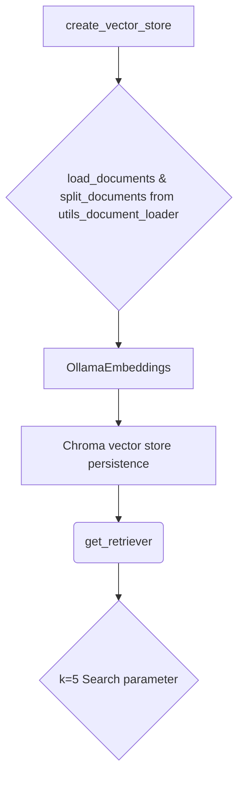
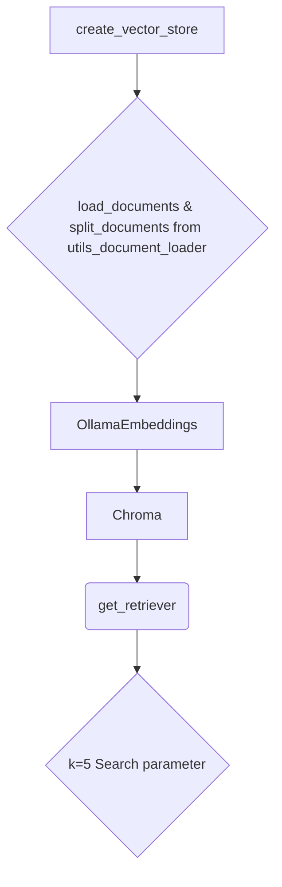

# services_vector_store Module Documentation

## Introduction
The `services_vector_store` module is a part of the larger system designed to facilitate vector storage and retrieval for documents. This module provides core functionality for creating, loading, and retrieving vector stores from a specified directory.

## Core Functionality
### Overview
- **create_vector_store**: Creates a new vector store from documents located in a specified directory.
- **load_vector_store**: Loads an existing vector store from the system's persistent storage.
- **get_retriever**: Returns a retriever object configured to retrieve the most relevant `k` documents based on similarity search criteria.

### Dependencies
# Data Flow

The following modules are dependencies for the `services_vector_store` module:
- [utils_document_loader](utils_document_loader.md)

## Component Details

### create_vector_store
```python
from langchain_chroma import Chroma
from langchain_ollama import OllamaEmbeddings
from config import EMBEDDING_MODEL, CHROMADB_PATH, OLLAMA_BASE_URL
from utils.document_loader import load_documents, split_documents
def create_vector_store(documents_path: str):
    try:
        # Create Embedding object
        embeddings = OllamaEmbeddings(
            model=EMBEDDING_MODEL,
            base_url=OLLAMA_BASE_URL
        )
        
        # Load documents
        loaded_documents = load_documents(directory_path=documents_path)
        splited_documents = split_documents(documents=loaded_documents)
        
        # Create vector store
        vector_store = Chroma.from_documents(
            collection_name="documents",
            embedding=embeddings,
            documents=splited_documents,
            persist_directory=str(CHROMADB_PATH)
        )
    except Exception as e:
        print(f"Error during vector store creating: {e}")
```

### load_vector_store
```python
def load_vector_store():
    try:
        
        # Create Embedding object
        embeddings = OllamaEmbeddings(
            model=EMBEDDING_MODEL,
            base_url=OLLAMA_BASE_URL
        )
        
        # Load vector store
        vector_store = Chroma(
            collection_name="documents",
            embedding_function=embeddings,
            persist_directory=str(CHROMADB_PATH)
        )
        return vector_store
    except Exception as e:
        print(f"Error during vector store loading: {e}")
        return None
```

### get_retriever
```python
def get_retriever(k=5):
    try:
        vector_store = load_vector_store()
        retriever = vector_store.as_retriever(search_kwargs={"k": k})
        return retriever
    except Exception as e:
        print(f"Error during retriever creation: {e}")
        return None
```

## Architecture Diagrams
### Component Relationships

### Data Flow
```mermaid
globalVarDefaults("flowchart", [
  {"name":"dir","value":"TB"}
])
graph TB
A[create_vector_store] --> B{load_documents & split_documents from utils_document_loader}
B --> C[OllamaEmbeddings]
C --> D[Chroma vector store persistence]
D --> E(get_retriever)
E --> F{k=5 Search parameter} 
```